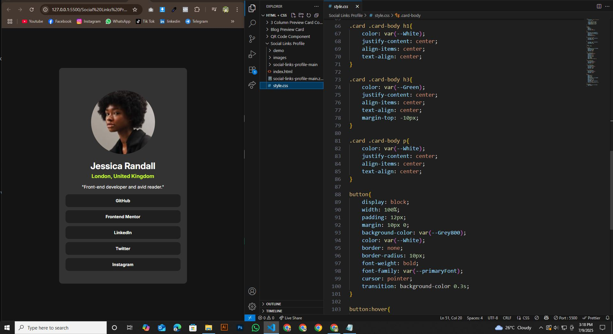

# Frontend Mentor - Social Links Profile Challenge

This is a solution to the [QR Code Component Challenge](https://www.frontendmentor.io/challenges/qr-code-component-iux_sIO_H) on [Frontend Mentor](https://www.frontendmentor.io/challenges/qr-code-component-iux_sIO_H). Frontend Mentor challenges help me improve my coding skills by building realistic projects.

## Table of contents

- [Overview](#overview)
  - [Screenshot](#screenshot)
  - [Project Links](#links)
- [My Process](#my-process)
  - [Built with](#built-with)
  - [What I learned](#what-i-learned)
  - [Continued development](#continued-development)
  - [Useful resources](#useful-resources)
- [Author](#author)
- [Acknowledgments](#acknowledgments)


## Overview

### Screenshot





### Links

- Solution URL: (https://github.com/hemal6325/Social-Links-Profile-Challenge)
- Live Site URL: (https://hemal6325.github.io/Social-Links-Profile-Challenge/)

## My Process
I built this project using HTML and CSS, focusing on layout design and responsive styling. Through it, I learned Flexbox, Semantic Markup, and how to create visually balanced components.

### Built With

- HTML5 Semantic Structure
- CSS3 Custom Properties
- Flexbox
- Mobile First Workflow


### What I Learned

During this experience, I gained valuable skills and deeper understanding of the subject. It helped me improve my problem-solving abilities and boosted my confidence in applying new concepts.


```css
:root{
    --primaryFont: "Inter", sans-serif;
    --fontsize: 14px;
    
    --Green: hsl(75, 94%, 57%);
    --White: hsl(0, 0%, 100%);
    --Grey700: hsl(0, 0%, 20%);
    --Grey800: hsl(0, 0%, 12%);
    --Grey900: hsl(0, 0%, 8%);
}

*,
*::after,
*::before{
    margin: 0;
    padding: 0;
    list-style: none;
    box-sizing: border-box;
}

body {
    font-family: var(--primaryFont);
    font-size: var(--fontsize);
    background-color: var(--Grey900);
    display: flex;
    align-items: center;
    justify-content: center;
}

h1, h2, h3, h4, h5, h6{
    font-family: var(--primaryFont);
    font-weight: 700;
    margin-bottom: 15px;
}

p{
    font-family: var(--primaryFont);
    font-weight: 400;
    margin-bottom: 15px;
}

.card{
    width: 400px;
}

.card-body{
    background-color: var(--Grey700);
    border-radius: 10px;
    padding: 30px 20px;
    text-align: center;
    margin-top: 125px;
}

.card .card-body img{
    justify-content: center;
    align-items: center;
    display: block;
    text-align: center;
    border-radius: 50%;
    object-fit: cover;
    width: 200px;  
    height: 200px;
    margin: 40px auto 20px auto;
}

.card .card-body h1{
    color: var(--White);
    justify-content: center;
    align-items: center;
    text-align: center;
}

.card .card-body h3{
    color: var(--Green);
    justify-content: center;
    align-items: center;
    text-align: center;
    margin-top: -10px;
}

.card .card-body p{
    color: var(--White);
    justify-content: center;
    align-items: center;
    text-align: center;
}

button{
    display: block;
    width: 100%;
    padding: 12px;
    margin: 10px 0;
    background-color: var(--Grey800);
    color: var(--White);
    border: none;
    border-radius: 10px;
    font-weight: bold;
    font-family: var(--primaryFont);
    cursor: pointer;
    transition: background-color 0.3s;
}

button:hover{
    background-color: var(--Green);
    color: black;
}


```

### Continued Development

I would like to make my own QR Generator so this could be used as a default template. The qr code could be links to a document or something along those ways. Going to think about something useful that could come in handy.

### Useful Resources

- [FLEXBOX FROGGY](https://flexboxfroggy.com/) - This helped me to understand better how to use flexbox.


## Author

- Frontend Mentor - [@hemal6325](https://www.frontendmentor.io/profile/hemal6325)
- GitHub Profile - [@hemal6325](https://github.com/hemal6325/)

## Acknowledgments


At some point i was a little stuck with setting the style for the image. And i solved this problem using online Resources, ChatGPT & Google Bard.


**Have Fun Building!** 🚀
